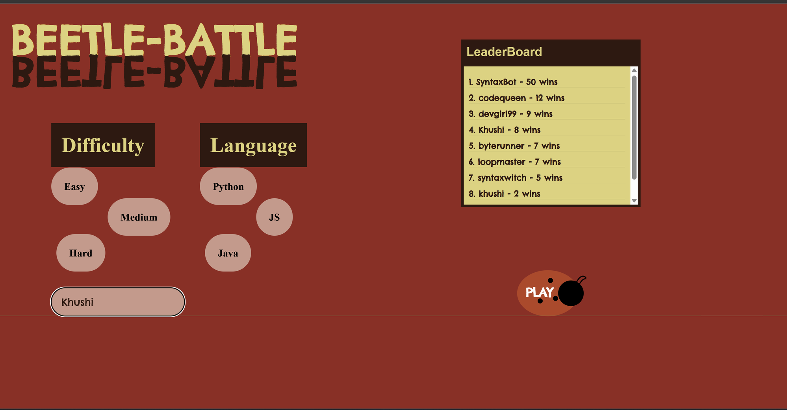
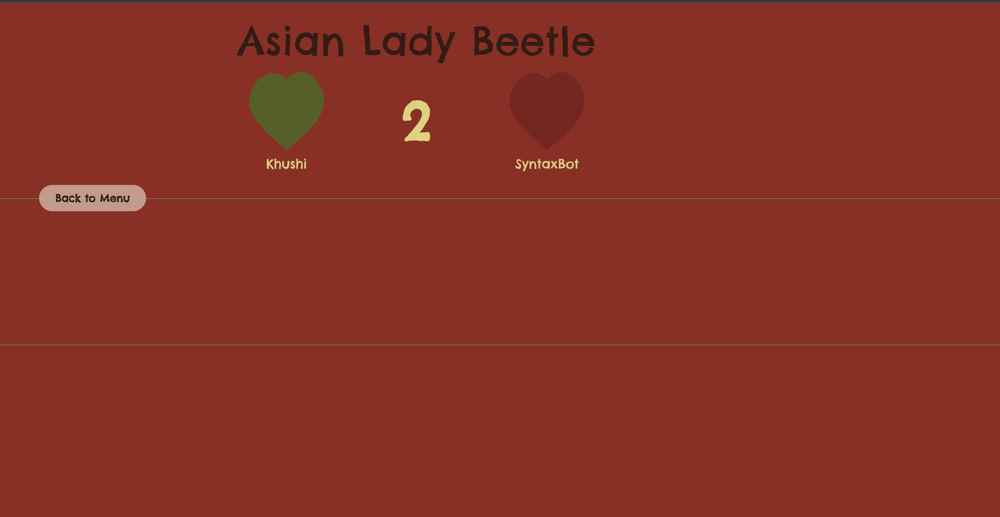
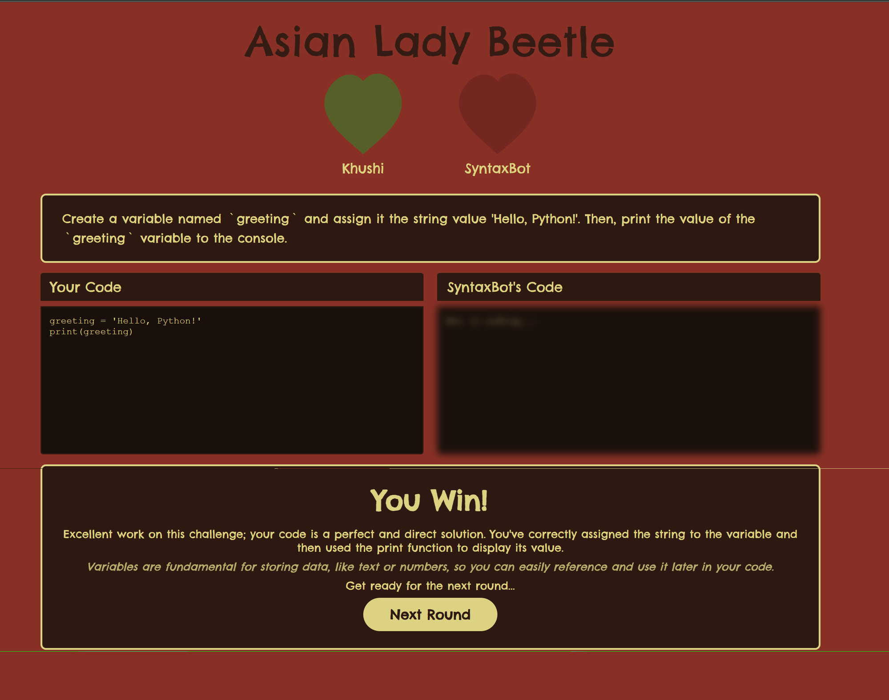
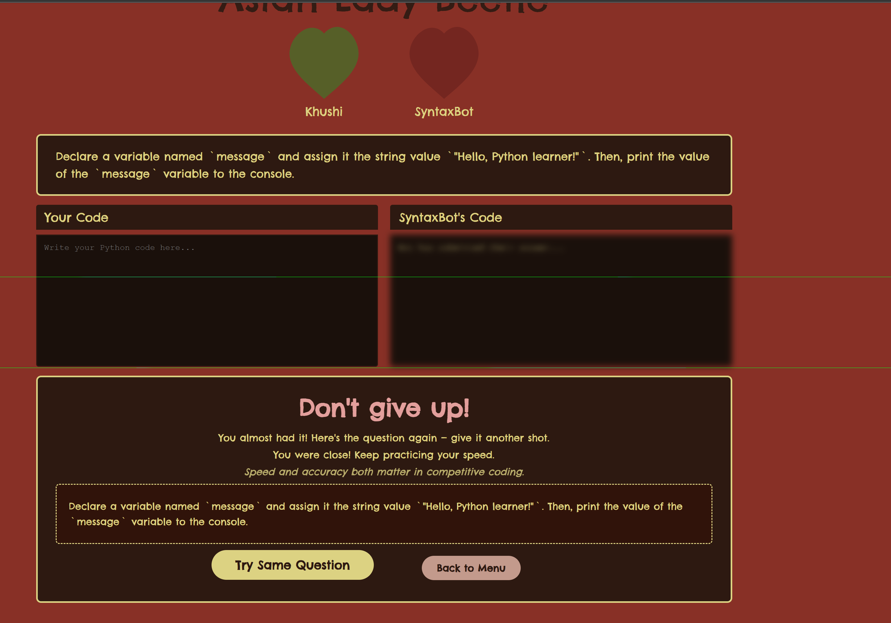

# ˚₊‧ʚ🐞ɞ‧₊˚ Beetle Battle ˚₊‧ʚ🐞ɞ‧₊˚


`Matchmaking` `Code Battle` `Leaderboard` `AI Judging` `Multi-Language`

Race a player. Defeat the imposter. Prove your syntax is your own.

> *"Like a lady-bug, their spots are unique. Similarly, every individual has a programming signature that's waiting to be shined upon."* — Samantha

---

## 🐞 What Beetle Battle Does

This is a **competitive syntax trainer**, not a tutorial.

Beetle Battle scans your ability to write real code under pressure — no autocomplete, no AI, no hints — by matching you against another player (or a bot) in real time. Both players receive the same prompt and race to produce the correct output across 3 difficulty levels and 3 languages.

The pipeline combines **AI-generated questions** (fully unique per match) with **Gemini-powered code evaluation**, producing a live battle arena with a persistent leaderboard and personalized post-match feedback.

---

## 📸 Visuals

**Home — Choose your fighter, language, and difficulty**


**Arena — You vs. the Asian Lady Beetle (SyntaxBot)**


**Victory — Correct output, Gemini feedback, next round**


**Defeat — Don't give up. Try the same question again.**


---

## ⚔️ 3 Difficulty Levels

| | Level | What it tests |
|-|-------|---------------|
| 🍄 | Easy | Print statements, variables, basic syntax |
| 🍄🍄 | Medium | Arithmetic, simple functions, conditionals |
| 🍄🍄🍄 | Hard | Algorithms — min/max, string reversal, counting |

---

## 🌐 3 Languages

| | Language | Example prompt |
|-|----------|----------------|
| 🐍 | Python | *"Create a variable named `greeting` and assign it `'Hello, Python!'`. Then print it."* |
| 🟨 | JavaScript | *"Declare a `const` named `sum` that stores the result of adding 14 and 28. Log it."* |
| ☕ | Java | *"Write a method that takes a String and returns it reversed."* |

---

## 🤖 Game Pipeline

| | Step | What happens |
|-|------|--------------|
| 🎯 | Question Generation | Gemini creates a unique prompt per language + difficulty |
| ⚡ | Matchmaking | Socket.io pairs two players (or spawns SyntaxBot) in real time |
| ⏱️ | Live Battle | Both players code simultaneously — same prompt, same clock |
| 🧠 | Code Evaluation | Gemini simulates execution and compares against expected output |
| 💬 | Feedback | Hints on failure, personalized notes on victory |
| 🏆 | Leaderboard | MongoDB updates wins, scores, streaks, and average time |

---

## ✨ Key Features

**🍃 Custom SVG UI**
Every shape was built from code — no image assets. The Ladybug "Play" button, Leaf battle arenas, and Mushroom difficulty selectors are all scalable, hand-coded SVG shapes inspired by Figma designs.

**🤖 Gemini AI Integration**
Google Gemini (`gemini-2.5-pro`) generates every question uniquely, evaluates your code's output, and delivers real-time feedback. No two matches are the same.

**⚡ Real-Time Multiplayer**
Socket.io keeps both players in sync — same prompt, same countdown, live opponent status. SyntaxBot enabled by default with a 25-second timer.

**🏆 Live Leaderboard**
Persistent rankings via MongoDB tracking wins, total matches, average score, average time, and win streak. Climb the ranks and become a Beetle King.

---

## 📊 Screens

| Screen | What's inside |
|--------|---------------|
| 🏠 Home | Fighter name · Language · Difficulty · Live leaderboard · Play button |
| ⚔️ Battle | Prompt · Your code editor · Opponent's blurred editor · Hearts (lives) |
| 🏆 You Win | Score · Gemini feedback · "Next Round" button |
| 💀 Don't Give Up | Hint · Prompt repeated · "Try Again" or "Back to Menu" |

---

## ⚡ Quick Start

```bash
# 1. Clone
git clone https://github.com/ximecamacho/beetlebattle.git
cd athenahacks2026

# 2. Install dependencies
npm install
cd backend && npm install && cd ..

# 3. Add environment variables
# Create backend/.env with the values below

# 4. Run the backend
cd backend && npm run dev

# 5. Run the frontend (separate terminal)
npm start
```

App opens at `http://localhost:5173`

---

## 🔑 Environment Variables

Create `backend/.env`:

```env
PORT=5000
MONGODB_URI=your_mongodb_connection_string
GEMINI_API_KEY=your_google_gemini_key
```

---

## 📁 Project Structure

```
athenahacks2026/
├── src/
│   ├── App.jsx                 ← Main app + screen router (home / battle / results)
│   ├── BattleScreen.jsx        ← Live arena UI with SVG editors
│   ├── Results.jsx             ← Match results + feedback screen
│   └── index.css               ← Global styles (Chelsea Market font, beetle theme)
│
├── backend/
│   ├── server.js               ← Express + Socket.io entry point
│   ├── sockets/game.js         ← Real-time game logic, matchmaking, bot mode
│   ├── services/gemini.js      ← Question generation, code eval, feedback
│   ├── routes/room.js          ← REST API (player, leaderboard, match)
│   └── db/
│       ├── connect.js          ← MongoDB connection
│       └── models/             ← Player and Match schemas
│
├── assets/                     ← Screenshots
├── vite.config.js              ← Vite config + proxy to backend
├── package.json
└── .gitignore
```

---

## 🎮 How To Play

- **Identity** — Enter your Fighter Name
- **Strategy** — Pick your language and difficulty (Mushroom buttons)
- **Deploy** — Click the Ladybug Play Button to enter the queue
- **Battle** — Read the prompt, write your solution in the right-hand editor, hit RUN
- **Win** — Correct output beats your opponent. Wrong answer? You get a hint and try again.

---

## ⚠️ Framing

Beetle Battle does not teach you to Google. It does not autocomplete. It does not forgive bad syntax. Every prompt is a hypothesis: *can you write this without help?* The leaderboard surfaces who can — and who can't yet.

---

## 🛠️ Built With

Figma · VSCode · React · Vite · Node.js · Express · Socket.io · MongoDB · Google Gemini API · CSS · JavaScript

---

## 👾 The Bug Hunters — AthenaHacks 2026

| Name | Role |
|------|------|
| Samantha Reap | Full-Stack Lead & UI/UX Designer |
| Khushi Patel | Developer |
| Allyson Le | Developer |
| Ximena Camacho | Developer |


---

## 🗺️ Future Roadmap

- [ ] Live language compilers (run code server-side)
- [ ] More game modes
- [ ] Sneaky attacks — throw banana peels at your opponent mid-battle

---

*˚₊‧ʚ🐞ɞ‧₊˚ May your spots shine brightest ˚₊‧ʚ🐞ɞ‧₊˚*
